# StudyLoop

Turn any textbook or web page into a personal tutor that runs on your own computer, with no GPU, no account and no model required.

You add a PDF, a markdown or text file, or a web address. StudyLoop converts it to clean notes, builds a navigable course (chapters, topics, key concepts), answers questions using only the book and shows exactly where every quote sits in the source, quizzes you topic by topic, tracks what you know with Bayesian Knowledge Tracing, tells you what to review next, and remembers your progress, notes and questions between sessions. Questions can be asked in English, Urdu or Roman Urdu.

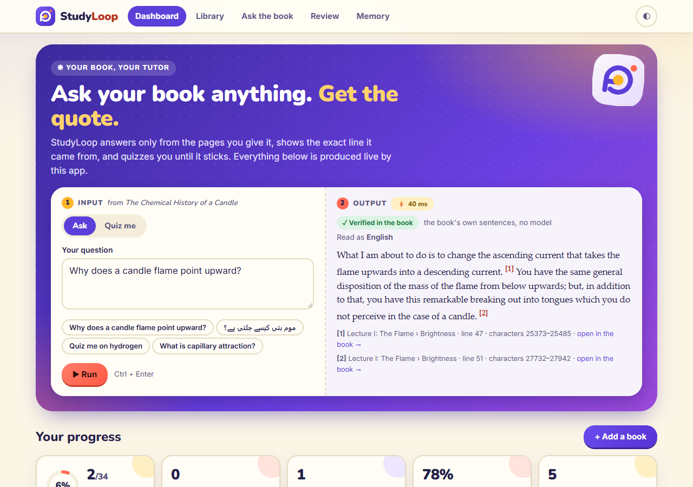

The home page has a live **try-it panel**: type a question about the book (English, Urdu or Roman Urdu) or a topic to be quizzed on, and the verified answer with its quote and location, or a generated quiz question, comes back from the app's own API with the time it took. Look: warm paper-cream (light) or ink-navy (dark), indigo/violet with coral and amber accents, Nunito headings, Inter body, progress rings for mastery.

| Quiz mode | Urdu question |
|---|---|
| 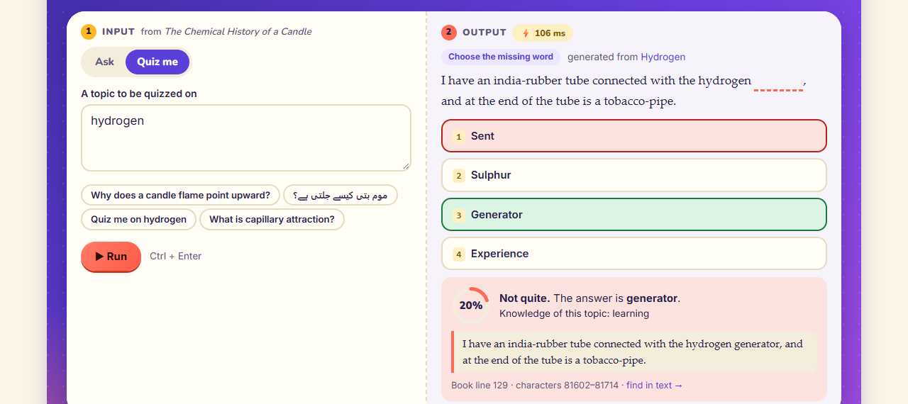 | 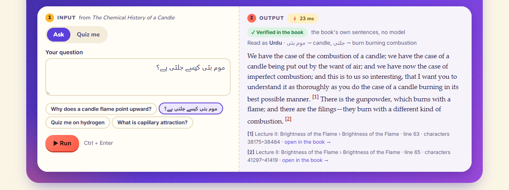 |

| | |
|---|---|
| **Library** | Upload PDF / markdown / text / HTML or paste a URL. A PDF goes through [book-to-skill](../book-to-skill) (layout repair, chapters from font sizes), a web page through [web-to-markdown](../web-to-markdown) (article extraction). |
| **Course builder** | Chapters, topics and key concepts as a navigable outline. Headings are used when the source has them; a chapter without sub-headings is cut into topics by lexical cohesion and named from its own title. |
| **Ask the book** | BM25 retrieval, extractive answers, every quote located in the source (character offsets and line number), and an honest "the book does not say" when it does not. An LLM can write the answer if you configure one, but its quotes are re-checked against the book. |
| **Quizzes** | Cloze, multiple choice and true/false per topic, generated from the book's own sentences, deterministic without a model. |
| **Mastery** | Per-topic BKT, mastery bars, "what to review next" and a spaced-review schedule with a forgetting curve. |
| **Memory** | SQLite: progress, notes, question history, sessions and versioned settings; searchable. |
| **Urdu / Roman Urdu** | Questions are normalised (urdunlp), mapped to English search terms through a small study glossary, English words kept, loanwords matched by sound. |

## Run it

```
uv run studyloop            # starts the server, opens http://127.0.0.1:8765, loads the sample book on first run
```

or double-click `run.bat`. Options: `--port`, `--no-browser`, `--no-sample`, `--db FILE`. Data lives in `~/.studyloop/studyloop.sqlite3` (set `STUDYLOOP_HOME` to move it). Python 3.11+ and [uv](https://docs.astral.sh/uv/); everything runs on the CPU and works offline.

Optional language model (never required): set before launching

```
STUDYLOOP_LLM=ollama      STUDYLOOP_LLM_MODEL=qwen2.5:3b          # CPU Ollama on localhost:11434
STUDYLOOP_LLM=anthropic   ANTHROPIC_API_KEY=...                   # STUDYLOOP_LLM_MODEL defaults to claude-haiku-4-5
STUDYLOOP_LLM=openai      OPENAI_API_KEY=...  STUDYLOOP_OPENAI_BASE_URL=...
```

With a model, answers are written in prose and quizzes can add model-written questions. Neither is trusted: a quote that is not found in the book is dropped, and a model question is kept only when its supporting quote is found in the topic. If the model is down, the extractive answer is shown instead.

Tests and checks:

```
uv run pytest -q            # 150 tests
uv run ruff check .
uv run python demo.py       # offline end-to-end demo (output below)
uv run python scripts/ask_check.py
uv run --with playwright python scripts/xss_check.py http://127.0.0.1:8799   # hostile book text in a real browser
uv run --with playwright python scripts/ui_tour.py http://127.0.0.1:8799 <db> docs/screenshots   # drives the real UI, regenerates the screenshots
```

## Input / Output

`uv run python demo.py`, no server and no model (full text in [docs/demo-output.txt](docs/demo-output.txt)):

```
Input : The Chemical History of a Candle (33,688 words, markdown)
Output: 6 chapters, 26 topics, 364 retrieval passages

Ask the book
  en       What is capillary attraction?
           -> line 29, chars 15635-15874, Mobility: "There is a beautiful point about that—capillary attraction[4]. “Capillary attraction!” you..."
  ur       موم بتی کیوں جلتی ہے؟
           -> line 63, chars 38175-38484, Brightness of the Flame: "We have the case of the combustion of a candle; we have the case of a candle being put out..."
  roman-ur pani kaise banta hai
           -> line 95, chars 59761-59855, Products: Water from the Combustion: "Here, again [holding another bottle], is some water produced by the combustion of an oil-l..."
  en       Who won the 1998 world cup?
           -> not in the book
  6 of 9 answered, every quote verified against the markdown
```

The sample is Michael Faraday's *The Chemical History of a Candle* (six lectures, 1848), public domain, from Project Gutenberg ebook 14474 and shipped in the package so the demo works offline. `scripts/prepare_sample.py` shows how the markdown was made from the Gutenberg text.

## Screenshots

All from the real UI, produced by `scripts/ui_tour.py`, which also fails on any console error or failed request (it reported none).

| | |
|---|---|
| 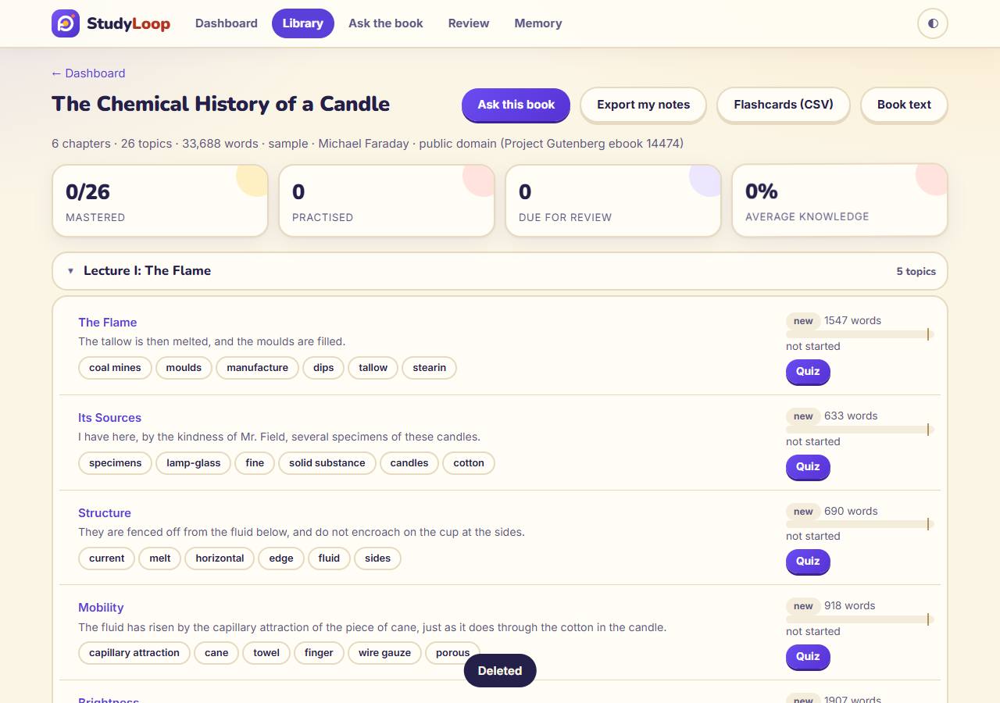 **Course outline**: chapters, topics, key concepts, mastery per topic | 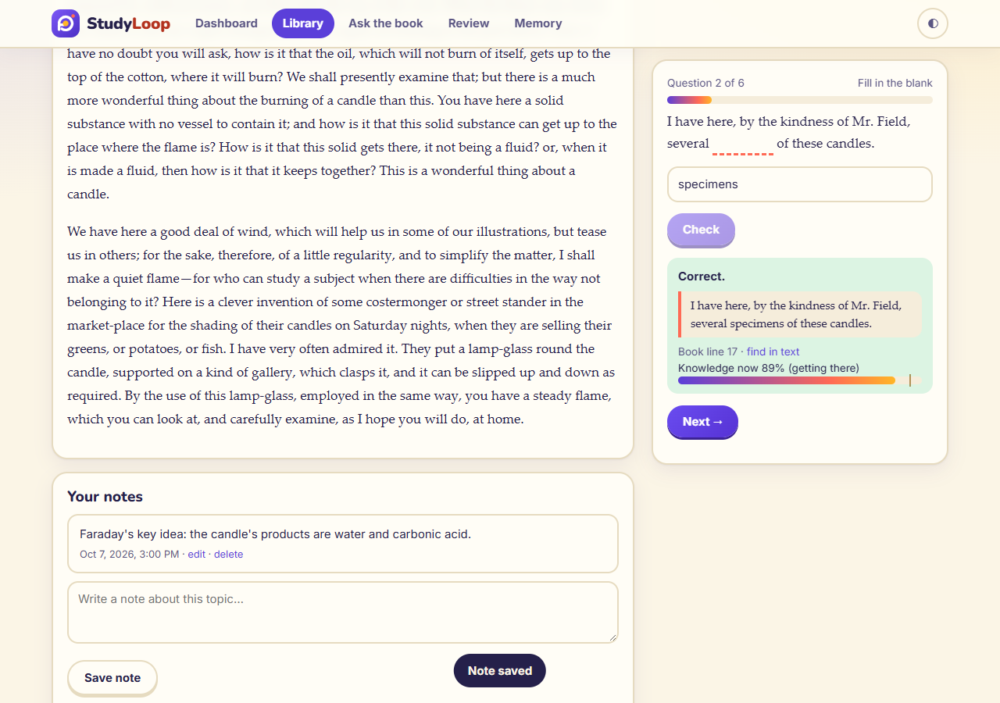 **Quiz**: the answer comes with the source sentence and its line in the book |
| 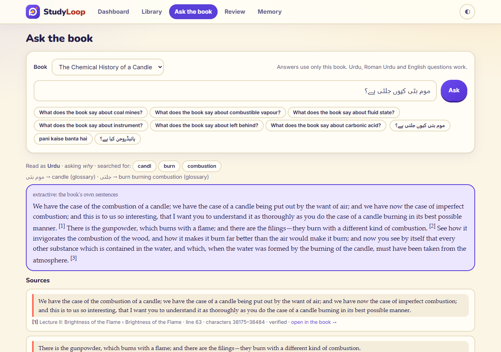 **Urdu question**, English book: what it understood, what it searched for, verified quotes | 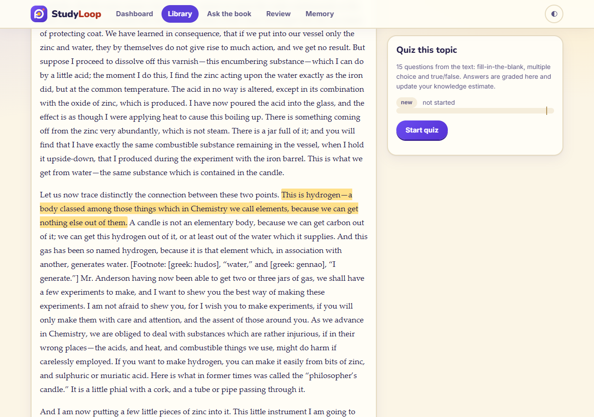 **Open in the book** jumps to the quote and highlights it |
| 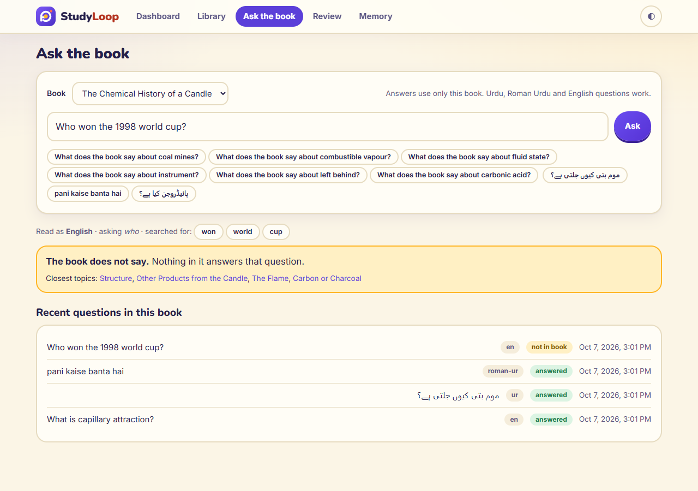 **Off-book question**: it abstains | 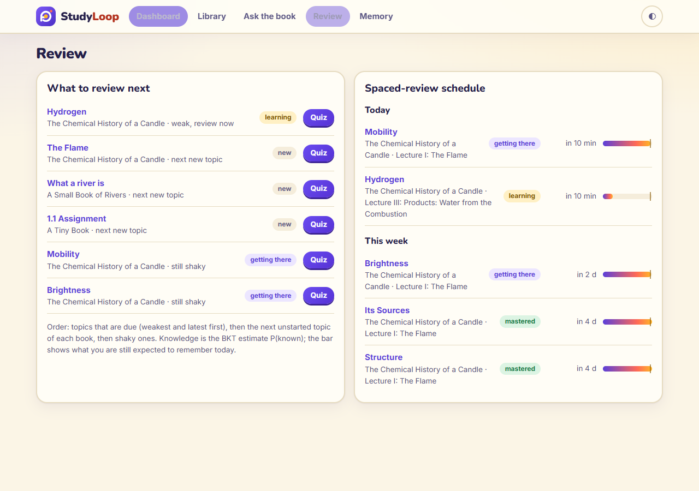 **Review**: what to do next and the spaced schedule |
| 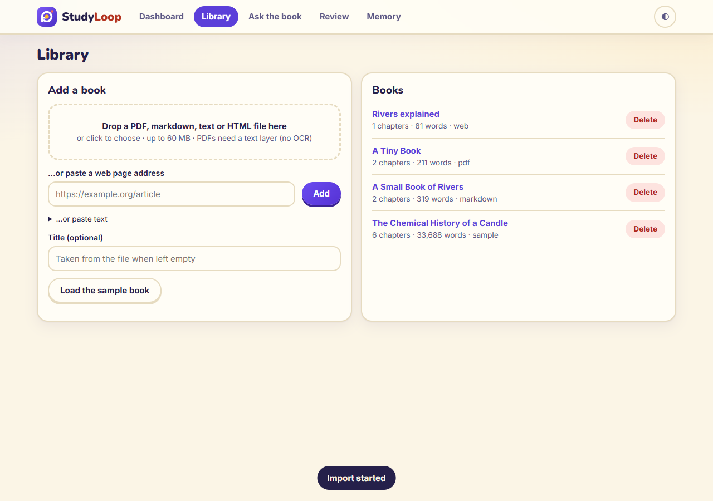 **Library**: file, PDF or URL import | 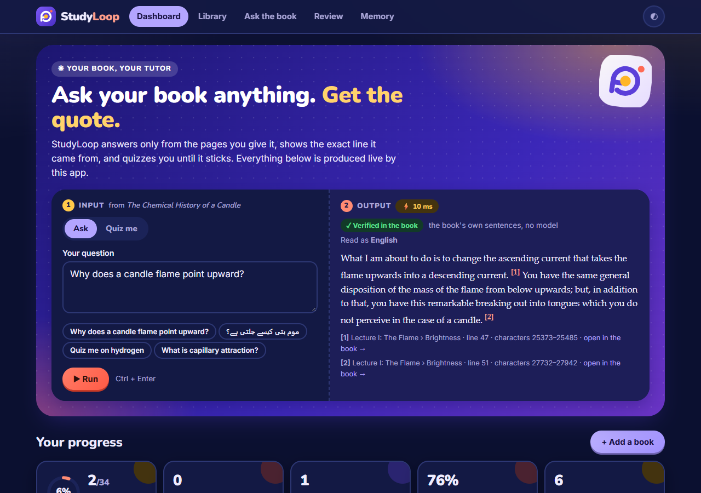 **Dark mode** (and a phone layout: [15](docs/screenshots/15-mobile-outline.png)) |

More: [reading a topic](docs/screenshots/06-reading-topic.png), [English answer](docs/screenshots/07-ask-english.png), [Roman Urdu answer](docs/screenshots/09-ask-roman-urdu.png), [quiz summary](docs/screenshots/05-quiz-done.png), [memory](docs/screenshots/13-memory.png).

## How it works

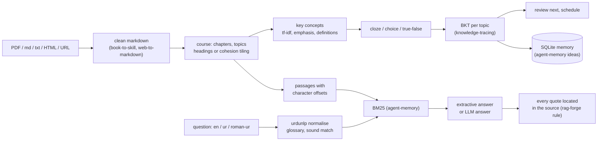

### What is reused from the other repos

| Repo | How | What for |
|---|---|---|
| `book-to-skill` | path dependency, unmodified | PDF text, layout repair, chapter and section detection |
| `web-to-markdown` (`web2md`) | path dependency, unmodified | fetch and article extraction |
| `urdu-nlp-toolkit` (`urdunlp`) | vendored read-only copy in `src/studyloop/_vendor/urdunlp` | normalisation, `roman_key`, stemming, stopwords, transliteration. One local patch: its data files are looked up with `resources.files(__package__)` so they resolve inside this package (noted in `_vendor/NOTICE`). |
| `agent-memory` | vendored `bm25.py`, ideas for the store | retrieval; sessions, event log, versioned facts ("a newer value supersedes the old one") |
| `rag-forge` | re-implemented (its code needs Postgres and torch) | quote location: a quote is accepted only when found in the source, tolerant of whitespace and case only |
| `knowledge-tracing` | re-implemented (the BKT forward filter) | per-topic P(known); mastery judged on P(known), threshold 0.95, never on P(correct) |

The sibling repos belong to other sessions and were only read. Source commits are listed in `src/studyloop/_vendor/NOTICE`.

### Mastery and review

P(known) starts at 0.30 and is updated after every answer with the BKT filter (learn 0.10, slip 0.20; guess 0.15 for a typed blank, 0.30 for four options, 0.55 for true/false). A question you have already seen counts less (guess 0.60), because a remembered answer is weak evidence. A topic is **mastered** only when P(known) is at least 0.95, you have given at least 8 answers and at least 6 of the last 8 were right. Review dates come from P(known): ten minutes when below 0.5 or after a miss, one day below 0.8, two days below 0.95, then 4 days growing by 2.2 times per successful review up to 90. "What you are expected to remember today" is P(known) times a forgetting curve whose stability puts recall at 0.9 on the due date.

## What the checks show

Every number below is printed by the code in this repository.

| Check | Result |
|---|---|
| Sample book import (markdown to course, concepts, passages) | 6 chapters, 26 topics, 364 passages in about 0.3 s |
| Quiz pool for the sample (rule-based, all 26 topics) | 381 questions: 125 cloze, 125 multiple choice, 131 true/false; 3 to 21 per topic, none without |
| Ask, on-book (26 questions, "What does the book say about X?", X = each topic's top concept) | 26 answered, 26 with a cited quote containing the concept's words. This is easy by construction: the question is built from the text. |
| Ask, off-book (24 questions the book cannot answer, `scripts/ask_check.py`) | 24 abstained. Before the phrase check one of the first 20 was answered ("What is the boiling point of mercury?"); the other 4 were added after the fix, so 24/24 is partly tuned and partly unseen. |
| Tests | 150 passing, ruff clean |
| UI tour in a real browser | uploads a markdown file, a PDF and a web page; plays quizzes; asks in three languages; opens a quote; changes settings; deletes a book. No console error or failed request. |

## Security (2026-10 review, details in [docs/REVIEW.md](docs/REVIEW.md))

- **URL import cannot reach your machine or network.** Only http(s); no `user:pass@`; `localhost`, `.local`, private, loopback, link-local (cloud metadata), CGNAT and IPv4-mapped IPv6 addresses are refused; every address a name resolves to is checked, the socket is opened to the checked address (no second lookup), each redirect is re-checked, and size (20 MB), time (30 s) and redirects (5) are capped. `STUDYLOOP_ALLOW_PRIVATE_URLS=1` is an operator-only switch for a local test server.
- **Uploads** are read in pieces and refused past 60 MB; the file name is reduced to a label and never used as a path; PDFs over 3,000 pages or password-protected are refused; extracted text over 8 million characters is refused; a 600 MB flate bomb in a 600 KB PDF fails cleanly (test).
- **Book text is escaped** before the UI builds HTML, links only allow http(s), and a Content-Security-Policy forbids inline script. `scripts/xss_check.py` imports a book of payloads and visits every page in a real browser.
- **Other websites cannot drive the local server**: requests whose Host is not localhost (DNS rebinding) and cross-site writes (Origin / Sec-Fetch-Site) get 403. Started with `--host 0.0.0.0` this guard is off, and there is still no login.

## What it does NOT do

- **No OCR.** A scanned PDF with no text layer is rejected with a message; so are other binary formats.
- **PDF structure is only as good as the PDF.** book-to-skill finds chapters from font sizes; a PDF with unusual fonts may come out as one flat chapter, which StudyLoop then cuts by cohesion.
- **Urdu support is for questions, not for books.** The book is read in English (or any language the retrieval tokeniser handles as Latin text); an Urdu book is not indexed properly. The question mapping is a glossary of 70 study words plus sound matching against the book's vocabulary, not a translator: a word it cannot resolve is shown as "not understood" rather than guessed.
- **The extractive answer is not a summary.** It returns the best-matching sentences verbatim, so a "why" question gets the passages that talk about the subject, not a reasoned explanation. A model can write one, with verified quotes.
- **Concepts and quiz sentences are heuristics.** Some key concepts are odd (a noun phrase picked by frequency), and some cloze blanks are answerable from context. Questions test recognition of the text you just read, not transfer.
- **BKT parameters are fixed priors, not fitted.** One learner and a few answers per topic leave nothing to fit, so the knowledge estimate is a sensible default rather than a calibrated probability.
- **Phrase check is a heuristic.** Questions of three or more content words must have two neighbouring question words close together in one passage. It stops "boiling point of mercury" matching a book that only boils mercury; a legitimate question phrased with the words far apart can now abstain.
- **One user, one machine.** No accounts, no sync, no multi-user locking beyond SQLite's.
- **No model is bundled** and the optional LLM path was tested against fakes and failure cases, not against a live model in this build.

## Problems hit while building this

- **Review pass 2026-10-07.** The off-book answer above, a URL importer that fetched `http://127.0.0.1:8765/api/...` for anyone who could submit a form, an unbounded upload read, and an "Export notes" button that exported the whole book. All fixed with tests; new: notes export (markdown), flashcards (CSV for Anki, formula-safe), paste-text import, and imports interrupted by a restart now show as failed instead of "processing" forever.

- **A lecture has no headings.** The sample's chapters are single speeches with a title such as "The Flame - Its Sources - Structure - Mobility - Brightness". Splitting on paragraphs gave topics of 2,500 words next to topics of 100 because the paragraphs are enormous. Fix: long paragraphs are cut at sentence boundaries into units of about 90 words before tiling, cuts need a minimum size relative to the chapter, and the title's own list names the topics.
- **BKT said "mastered" after six answers.** With a guess rate of 0.05 for a typed blank, one correct blank and one correct choice took P(known) to 0.97, and with slip 0.10 a wrong answer barely moved it. Fixed in three steps: higher guess rates (a blank can be filled from the sentence around it), slip 0.20, and a mastery rule that also needs 8 answers and 6 of the last 8 right. Repeating a question you have already answered now counts as weak evidence.
- **Every abstention test passed except the ones that mattered.** The first version computed "support" as the share of question terms found in the chosen sentences, and treated words absent from the book as weightless, so "Who won the 1998 world cup?" scored 1.0 on the single word "cup". Absent words now count as the rarest possible terms, and support is judged on a single passage, not the union of sentences.
- **Roman Urdu is noisy to detect.** urdunlp's token tagger calls "candle" Urdu, and its `roman_key` maps `jalna` to a different word from `jalti`. Detection is now by function words, and glossary matching uses the key and the stem together.
- **A vendored package that finds its data by name.** urdunlp loads its tables with `resources.files("urdunlp")`, which fails once the package is nested under another name; one line changed in each of two files.
- **Cloze and multiple choice share a sentence.** The UI tour could not tell which stored question it was looking at from the prompt alone; it now reads the kind from the page.
- **Ten minutes is not "due".** After a failed quiz the topic was scheduled in ten minutes, so "what to review next" skipped it. A practised topic below 0.6 is now offered immediately.
- **Smooth scrolling was cancelled by the router.** "Open in the book" scrolled, then the page's own scroll reset undid it; the reset is skipped when a highlight is requested.

## Layout

```
src/studyloop/
  net.py         safe URL fetch (no private addresses, bounded)
  exports.py     notes as markdown, flashcards as CSV
  ingest.py      PDF / md / text / HTML / URL -> markdown -> course
  structure.py   headings or cohesion tiling -> chapters, topics, paragraphs with offsets
  concepts.py    key concepts, definitions, one-line summaries
  ask.py         retrieval, extractive and LLM answers, quote verification
  urdu.py        question normalisation, glossary, sound matching
  quiz.py        cloze / choice / true-false generation, grading, optional model questions
  mastery.py     BKT, forgetting curve, review order, schedule, activity
  memory.py      sessions, event log, notes, versioned facts, recall
  llm.py         optional Ollama / Anthropic / OpenAI-compatible client (stdlib only)
  app.py         FastAPI endpoints, background import
  static/        the single-page app (HTML, CSS, JS; no build step)
  sample/        Faraday, The Chemical History of a Candle (public domain)
  _vendor/       read-only copies, see NOTICE
tests/           150 tests: units for every module, API tests for every endpoint
scripts/         ui_tour.py, xss_check.py, ask_check.py, make_icon.py, prepare_sample.py
```

Licence: MIT for the code. The sample text is in the public domain; the vendored urdunlp keeps its own MIT licence and CC BY-SA data licence in `src/studyloop/_vendor/urdunlp/`.
