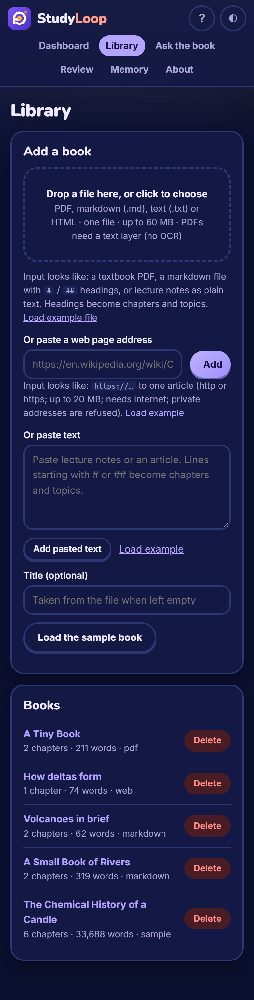

# Gallery captions

Produced by `scripts/gallery.py` from the real UI (1440x900, dark unless stated).

## Library

### 01-library-empty.png

The Library on a fresh install: the drop box, a web address field, a paste box and a book list that says there are no books yet.

### 02-library-sample-loaded.png

Input: a click on "Load the sample book" (Faraday's The Chemical History of a Candle, shipped offline). Output: the book card with its chapter and word counts.

### 03-library-upload-file.png

Input: the file a-small-book-of-rivers.md chosen with the file picker. Output: the upload message and progress bar while it is sent; the book is converted in the background.

### 04-library-upload-done.png

Output of the upload: the markdown file is now a book in the list with its chapters and word count, and the form confirms what was added.

### 05-library-paste-text.png

Input: lecture notes with two ## headings pasted into the text box with the title "Volcanoes in brief". Output: "Volcanoes in brief" in the book list with its chapters and words; the form confirms it was added.

### 06-library-import-url.png

Input: a web address, here a page served from this machine (the operator switch STUDYLOOP_ALLOW_PRIVATE_URLS=1 is set only for this script; normally private addresses are refused). Output: the article "How deltas form" in the book list, its navigation and footer dropped, with the form confirming it was added.

### 07-library-all-books.png

Output after a markdown file, pasted text, a web page and a PDF were added: five books in the list, each with chapters, words and source type.

### 08-library-refused.png

Input: an .exe file chosen by mistake. Output: the browser refuses it at once with a clear message; nothing is uploaded.

## Home and Try it

### 09-home.png

The home page on first visit: the try-it panel has already answered its default question from the sample book, with the timing, above the progress overview.

### 10-tryit-english.png

Input: the English question "What is capillary attraction?" typed in the Ask box. Output: the book's own sentences as the answer, with the verified quote, its line and character range, and the time taken.

### 11-tryit-urdu.png

Input: an Urdu question (why does a candle burn?) typed against an English book. Output: what it understood (Urdu), the English search terms it mapped to, and a verified quote.

### 12-tryit-quiz-me.png

Input: the Quiz me tab with the topic word "hydrogen". Output: a question generated from the book's own sentence, waiting for an answer.

### 13-tryit-quiz-answered.png

Input: the correct option clicked. Output: green verdict, the correct answer, the source sentence with its book line, and the knowledge estimate for the topic.

## Course outline

### 14-course-outline.png

Input: the sample book opened from the Library. Output: its chapters, topics, one-line summaries, key concepts and the export buttons, with per-topic mastery.

## Ask the book

### 15-ask-english.png

Input: "What is capillary attraction?". Output: the answer as the book's own sentences, numbered sources, and each quote verified at exact character offsets.

### 16-ask-urdu.png

Input: an Urdu question about why a candle burns. Output: the language detected, the words mapped to English search terms, and verified quotes from the English book.

### 17-ask-roman-urdu.png

Input: a Roman Urdu question (how is water made). Output: the question understood as Roman Urdu, the mapped terms, and the passage about water from combustion.

### 18-ask-not-in-book.png

Input: a question the book cannot answer. Output: "The book does not say" with closest topics, rather than an invented answer.

### 19-ask-with-quote.png

Input: "What is hydrogen?". Output: the quote with its chapter, topic, line number and character range, and the "open in the book" link that is clicked next.

### 20-open-in-book.png

Input: a click on "open in the book". Output: the topic page scrolled to the exact quote, highlighted in the source text.

## Quiz

### 21-topic-note.png

Input: a note typed under a topic. Output: the note saved below the reading text, ready to appear in Memory and in the notes export.

### 22-quiz-question.png

Input: Start quiz on the topic. Output: the first generated question, built from a sentence of the topic text.

### 23-quiz-correct.png

Input: the correct answer given. Output: green feedback, the source sentence with its line, and the topic's updated knowledge estimate.

### 24-quiz-wrong.png

Input: a deliberately wrong answer. Output: red feedback showing the right answer, the source sentence it came from, and a lower knowledge estimate.

### 25-quiz-summary.png

Output of finishing the round: the summary with the score for this topic and the options to go again or move on.

## Review and mastery

### 26-review.png

Input: the quizzes taken so far. Output: what to review next, in order, with the knowledge level for each, and the spaced-review schedule with the next due dates.

### 27-mastery-outline.png

Output: mastery per topic after the quizzes: counts of mastered, practised and due topics, and for each practised topic the knowledge percentage and answers right.

### 28-home-progress.png

Output: the home page progress overview after studying: topics mastered ring, reviews due, streak, accuracy, questions asked and the daily activity chart.

## Memory, notes and settings

### 29-memory-search.png

Input: "capillary" typed in the memory search. Output: the past questions that matched with their score; the same question asked on the home page and on the Ask page is one hit marked with how many times it was asked. The notes and question history are below.

### 30-memory-search-notes.png

Input: "water" typed in the memory search. Output: the note written earlier on the topic page is found, along with matching questions.

### 31-settings.png

Input: the daily goal changed to 25 answers and Save settings pressed. Output: the "Settings saved" confirmation; the model panel says no language model is configured and everything still works.

## Exports

### 32-export-notes.png

Input: the Export my notes button on the book page. Output: the downloaded notes.md, shown as received: a markdown file with the book's topics and the note written above.

### 33-export-anki-csv.png

Input: the Flashcards (CSV) button. Output: the downloaded flashcards.csv (front, back, source), ready to import into Anki: a card only for a key concept the book defines or makes the subject of a sentence, so the sample's 33,688 words give 10 cards.

## About

### 34-about.png

The About page: what StudyLoop is and does, how to use each input, what it does not do, privacy and the maker.

## Light mode and phone

### 35-home-light.png

The same home page in light mode (the theme follows the system and has a toggle in the header).

### 36-home-phone.png

The home page at phone width (390 px): the six navigation links wrap onto their own row under the logo so every page is one tap away, and the try-it panel reflows to one column.

### 37-library-phone.png

The Library at phone width: the nav row, the add-a-book form in one column, and the book list below it.
